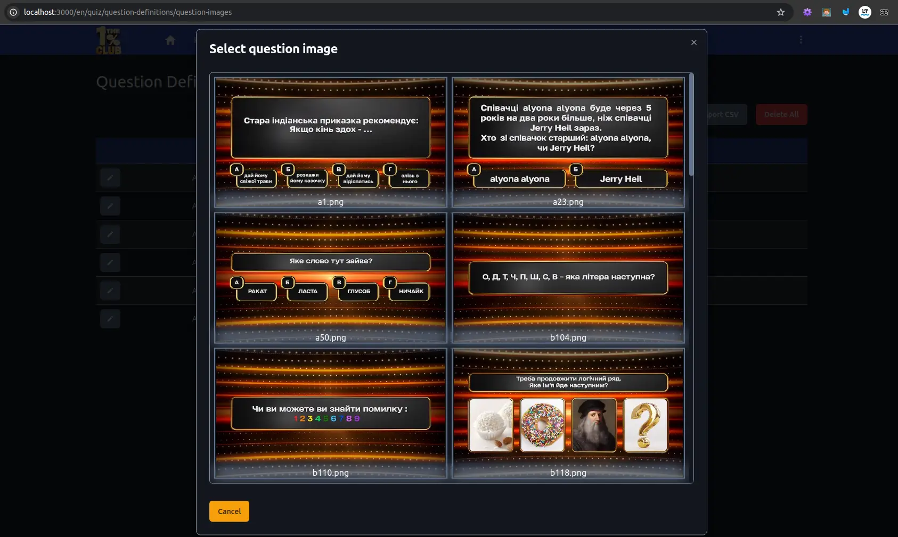

# Quiz app. Nextjs admin web and back.

<a name="top"></a>

1. [Install Prisma](#install-prisma)
2. [Tailwind with shadcn component library](#tailwind-with-shadcn-component-library)
   - [Tailwind dark mode](#tailwind-dark-mode)
3. [Next.js internationalization](#nextjs-internationalization)
4. [Next.js cookies](#nextjs-cookies)
   - [Theme preference in cookie](#theme-preference-in-cookie)
5. [Create modal form in Next.js (Edit Player)](#create-modal-form-in-nextjs)
6. [Plain Next.js form with server action (Import file)](#plain-nextjs-form-with-server-action)
   - [Loader on button](#loader-on-button)
7. [Shadcn Toast component](#shadcn-toast-component)
8. [MINIO container for local S3 file storage](#minio-container-for-local-s3-file-storage)
9. [State management with useContext and useReduser](#state-management-with-usecontext-and-usereduser)
10. [Server Send Events (S3 bucket update)](#server-send-events)
11. [Page Context](#page-context)
12. [Tailwind scrollbar styling](#tailwind-scrollbar-styling)
13. [React-Query](#react-query)
    - [useCashedQuery custom hook](#get-data-using-custom-hook-usecachedquery)
    - [Optimistic mutation](#optimistic-update-show-data-preview-on-data-mutation)
14. [Zustand](#zustand)
    - [Update Zustand on changes in MinIO buckets](#1️⃣-bucket-content-changes-minio)

## Install Next project

```js
npx create-next-app@latest .
```

## Install Prisma

[Prisma quickstart doc](https://www.prisma.io/docs/getting-started/quickstart)

```js
npm i --save-dev ts-node
npm install prisma --save-dev
npx prisma init --datasource-provider postgresql
```

This will create `prisma/schema.prisma` in root dir.

If you change database run:

```js
npx prisma generate
```

[Prisma in Fullstack Next.js](https://www.prisma.io/docs/orm/more/help-and-troubleshooting/help-articles/nextjs-prisma-client-dev-practices)

- You need to create `src/db/db.ts`

To [create migration](https://www.prisma.io/docs/getting-started/quickstart)
(Create/Change database and table)

```js
npx prisma migrate dev --name init
```

<a href="#top">⬅️ Back to top</a>

## Tailwind with [shadcn](https://ui.shadcn.com/docs/installation/next) component library

Run the shadcn-ui init command to setup your project:

```js
npx shadcn-ui@latest init
```

Into the `src/lib/utils.ts` will be added `cn` function for merging class names

Add font family variable to `tailwind.config.ts`

```js
import { fontFamily } from 'tailwindcss/defaultTheme'; // <--

const config = {
  darkMode: ['class'],
  content: [
  ],
  prefix: '',
  theme: {
    container: {
      },
    },
    extend: {
      fontFamily: { // <--
        sans: ['var(--font-sans)', ...fontFamily.sans],
      },
```

Use `cn` function to config mix style in `src/app/layout.tsx`

```js
import { cn } from '@/lib/utils';

const inter = Inter({ subsets: ['latin'], variable: '--font-sans' });

export default function RootLayout({
  children,
}: Readonly<{
  children: React.ReactNode,
}>) {
  return (
    <html lang="en">
      <body
        className={cn(
          // <--
          'bg-background min-h-screen font-sans antialiased',
          inter.variable // <--
        )}
      >
        {children}
      </body>
    </html>
  );
}
```

---

### Tailwind dark mode

**_To implement dark mode you should get though the next steps:_**

1. Use the css variables in root (default light) and dark classes for color
   definition in `global.css`.

2. Refer to this vars in `tailwind.config.ts` in the theme.extend.colors.

3. Implement localStorage services in `src/lib/localStor.ts` for store user
   preferences in local storage. Check the `global?.window === undefined` before
   read from local storage to prevent reading on server side render, before
   loading page code to the client browser.

4. Define `PreferencesContext` and `PreferencesProvider` in
   `src/context/preferences-provider.tsx`. Current color theme will be loaded
   from local storage in PreferencesProvider useState, and could be updated
   inside local storage by useEffect. Whereas using Next.js with his server side
   rendering, we need to use `use client` in module definition and we ought to
   check that component `PreferencesProvider` is mounted in time we call local
   storage services.

5. In `src/app/layout.tsx` wrap children of `RootLayout` into
   `PreferencesProvider`.

6. In `src/components/Nav/components/NavMenuActions.tsx` implement
   `ThemeToggleDropdownItem`. This component is a part of Navigation drop down
   menu. Click on it will toggle `PreferencesProvider` state which in turn will
   add/remove `dark` class to/from the document.documentElement inside its
   useEffect.

7. Add `ThemeToggleDropdownItem` to the `NavMenu` in
   `src/components/Nav/components/NavMenu.tsx`

<a href="#top">⬅️ Back to top</a>

## Next.js internationalization

[Next.js internationalization docs](https://nextjs.org/docs/app/building-your-application/routing/internationalization)
|
[Youtube video from Rendr](https://www.youtube.com/watch?v=_airUG9o97w&list=PLyPmN8OaxCPb3lCMtklvEtTFAJ6MWAKXf&index=1)
|
[Github repo with no slug on default lang](https://github.dev/rendrdotio/i18n-libraries)

**_Internalization workflow_**

- In `next.config.mjs` set permanent redirection (page that will be opened on
  server base url) **_example:_** `/quiz`

- If url doesn't contain `lang` slug , `middleware.ts` is taken into account.
  Inside the middleware we choose lang from locales in header (browser settings)
  if there are some matches between headers accept-language and locales defining
  in `i18n-config.ts` rout will be redirected to the rout with matched lang. If
  no matches occur default lang from `i18n-config.ts` will be taken.
  **_example:_** `uk/quiz` _where `uk` comes from browser settings_

- In `PreferencesProvider` on first initialization of `userPreferences` state
  from local storage, lang param set to `UNKNOWN_LOCALE`.

  On first render, check if the local storage contains lang preferences
  (userPreferences.lang !== UNKNOWN_LOCALE) If it is **first time we open the
  application** (userPreferences.lang === UNKNOWN_LOCALE) we set
  userPreferences.lang in state and local storage to the value that is come from
  url (lang has sat in middleware form browser settings)

  If it isn't first time we open app (prefs exist in local storage) and lang
  from pathName not equal to lang from prefs, rout will be redirected to the
  rout with lang from prefs.

  ```js
  if (pathNameLocale !== userPreferences.lang) {
    router.push(redirectedPathName(userPreferences.lang, pathName));
  }
  ```

- Internalization prefs are changed from `NavMenu.tsx` where setUserPreferences
  of PreferencesProvider is obtained from usePreferencesContext()
  ```js
  const { userPreferences, setUserPreferences } = usePreferencesContext();
  ```

**_[Localization](https://nextjs.org/docs/app/building-your-application/routing/internationalization#localization)_**

- We've created dictionary json file in dictionaries folder for every language.
  Also we've created `getDictionary(lang)` func for dynamic loading json file
  into pages where we need it

  ```js
  import { getDictionary } from './dictionaries';
  
  export default async function Page({ params: { lang } }) {
    const dict = await getDictionary(lang); // en
    return <button>{dict.products.cart}</button>;
  }
  ```

<a href="#top">⬅️ Back to top</a>

## Next.js cookies

[LogRocket Next.js cookie article](<https://blog.logrocket.com/guide-cookies-next-js/#:~:text=To%20read%20incoming%20request%20cookie,cookies()%3B%20const%20userId%20%3D%20cookieStore.>)

**_Preferences in cookie workflow_**

The advantage that you can take from saving preferences in cookies over local
storage is that it's independent of windows existence on client. Cookies are
available during SSR (layouts or pages that are rendered on server) through the
request header and in the middleware through NextRequest param. Therefore, you
can set internationalization rout in middleware and class for theme in
Rootlayout before client side rendering will be involved.

Notice that there are two approaches for access cookie on server side and one on
client site.

1. [The cookies function](https://nextjs.org/docs/app/api-reference/functions/cookies)
   allows you to read the HTTP incoming request cookies from a Server Component
   or write outgoing request cookies in a Server Action or Route Handler.

   ```js
   import { cookies } from 'next/headers';
   ```

2. [Cookies in Next.js middleware](https://nextjs.org/docs/app/building-your-application/routing/middleware#using-cookies)

   ```js
   export function middleware(request: NextRequest) {
     const theme = request.cookies.get('lang')?.value;
     ...
   }
   ```

3. Client side.
   [Document cookie MDN](https://developer.mozilla.org/en-US/docs/Web/API/Document/cookie)

   To read particular cookie value from document I use function:

   ```js
   const getCookieValue = (name: string) => {
   if (global?.window !== undefined) {
    return document.cookie.match('(^|;)\\s*' + name + '\\s*=\\s*([^;]+)')?.pop() || '';
   }
   }
   ```

### Theme preference in cookie

[Why you can't set cookies in Server Components](https://www.youtube.com/watch?v=ejO8V5vt-7I)

Imagine you are opening site first time, cookie is empty. Middleware
`withCookieThemeMiddleware` (`src/middlewares/withCookieThemeMiddleware.ts`) set
theme cookie to "dark" if no cookie in the request. RootLayout is being rendered
on the server (`src/app/layout.tsx`), theme value came from server actions
getThemeCookie() (`src/actions/cookies.ts`) if it had been set before on the
website. Otherwise if no theme cookie obtained theme set to 'dark':
`<html className={theme || 'dark'}>`. When page is rendered on client -
PreferencesProvider (`src/context/preferences-provider.tsx`) catches change mode
event from menu (`src/components/Nav/components/NavMenu.tsx`), writes theme
value to the cookies and sets theme class in the page html tag
`document.documentElement.classList.add(userPreferences.mode)`.

```js
document.documentElement.classList.remove('dark', 'light');
document.documentElement.classList.add(userPreferences.mode);

document.cookie = `theme=${userPreferences.mode}; max-age=31536000; path=/`;
```

### Language preference in cookie

[Implementing Multiple Middleware in Next.js](https://medium.com/@tanzimhossain2/implementing-multiple-middleware-in-next-js-combining-nextauth-and-internationalization-28d5435d3187)

Imagine you are opening site first time, cookie is empty. While middleware
`withI18nMiddleware` (`src/middlewares/withI18nMiddleware.ts`) handles request
without lang cookie, it takes lang value from locales in header (browser
settings). Then middleware redirects request accordingly to lang slug and write
it to the cookie. On the client side `PreferencesProvider` is responsible for
handling languages changes from menu and store it to cookie for future use.

<a href="#top">⬅️ Back to top</a>

## Create modal form in Next.js

- Video:
  [Modal Form w/ React-Hook-Form](https://www.youtube.com/watch?v=WyL_Jc6_-sY) |
  [Parallel routes](https://www.youtube.com/watch?v=M836RZxReHU) |
  [Modal w/ Parallel & Intersepting routes](https://www.youtube.com/watch?v=Ft2qs7tOW1k)

- Next:
  [Parallel Routes](https://nextjs.org/docs/app/building-your-application/routing/parallel-routes)
- React-Hook-Form:
  [isDirty changing to true when no field is actually dirty](https://github.com/react-hook-form/react-hook-form/issues/3213)

  ***

1. Create zod schema for the form `src/schemas/Player.ts`
2. Add inputs label to localization file `dictionaries/en.json`
3. Create PlayerForm `src/app/[lang]/quiz/players/edit/[id]/PlayerForm.tsx`
   component with `react-hook-form` and Form from `shadcn/ui`

   _Code for debug schema:_
   _`src/app/[lang]/quiz/players/edit/[id]/PlayerForm.tsx`_

   ```js
   const form =
     useForm <
     Player >
     {
       mode: 'onBlur',
       resolver: zodResolver(PlayerSchema),
       // resolver: async (data, context, options) => {
       //   // you can debug your validation schema here
       //   console.log('formData', data);
       //   console.log(
       //     'validation result',
       //     await zodResolver(PlayerSchema)(data, context, options)
       //   );
       //   return zodResolver(PlayerSchema)(data, context, options);
       // },
       defaultValues: {
         ...defaultUser,
         id,
         name: `Default user ${id}`,
       },
     };
   ```

4. Implement components for modal form:

   - `src/components/modal/modal.tsx`
   - `src/components/modal/inputWithLabel.tsx`
   - `src/components/modal/checkboxWithLabel.tsx`

5. Implement services for fetching player data `src/services/players.ts`
6. Implement action for save player data `src/actions/player.ts`
7. Create parallel rout with interception for modal form.
   _`src/app/[lang]/quiz/players/@modal/(.)edit/[id]/page.tsx`_

   _Don't forget to create layout for page with parallel rout:_
   _`src/app/[lang]/quiz/players/layout.tsx`_

   ```js
   export default function PlayersLayout({
   children,
   modal,
   }: Readonly<{
   children: React.ReactNode;
   modal: React.ReactNode;
   }>) {
   return (
    <>
      {modal} //<---------
      {children}
    </>
   );
   }
   ```

8. Create fallback page for modal form:
   `src/app/[lang]/quiz/players/edit/[id]/page.tsx`
9. Add alertConfirmation modal with form dirty state in local storage:
   `src/components/modal/alertConfirmation.tsx`

   `src/app/[lang]/quiz/players/edit/[id]/PlayerForm.tsx`

   ```js
   ...

     useEffect(() => {
    if (Object.keys(form.formState.dirtyFields).length > 0) {
      localStorage.setItem('playerFormModified', 'true');
    } else {
      localStorage.setItem('playerFormModified', 'false');
    }
   }, [form.formState]);
   ```

   `src/components/modal/modal.tsx`

   ```js
   export function Modal(...) {
     const [showExitConfirmation, setShowExitConfirmation] = useState(false);
     const router = useRouter();

     const closeModal = () => {
       router.back();
     };

     const handleOpenChange = () => {
       const isPlayerFormModified = localStorage.getItem('playerFormModified');
       if (isPlayerFormModified && JSON.parse(isPlayerFormModified)) {
         setShowExitConfirmation(true);
       } else {
         router.back();
       }
     };

     return (
       <Dialog defaultOpen={true} open={true} onOpenChange={handleOpenChange}>
         <DialogPortal>
           <DialogOverlay className="bg-gray-500 bg-opacity-10">
             <DialogContent className="overflow-y-hidden xl:w-2/4 w-3/4">
               <AlertConfirmation
                 open={showExitConfirmation}
                 setOpen={setShowExitConfirmation}
                 confirmationAction={closeModal}
                 message={alertConfirmationMessage ?? ''}
               />
               <DialogTitle>{title}</DialogTitle>
               <DialogDescription>{description}</DialogDescription>
               {children}
             </DialogContent>
           </DialogOverlay>
         </DialogPortal>
       </Dialog>
     );
   }
   ```

<a href="#top">⬅️ Back to top</a>

## Plain Next.js form with server action

In quiz-admin application I have a few form for csv and image file uploading.
Most of them located on quiz dashboard page. A few on the other pages. To
address this file input I've developed server actions and versatile simple form
component.

[Next.js File Uploads: Server-Side Solutions](https://www.pronextjs.dev/next-js-file-uploads-server-side-solutions)
|

   

Create bunch of server actions for each import file form:

_src/app/[lang]/quiz/actions.ts_

```js
type Action = typeof questionImages;

interface ImportFileActionType {
  [key: string]: Action;
}

const importFileAction: ImportFileActionType = {
  seatInfo,
  playerData,
  externalQuestionData,
  externalPlayerInfo,
  questionImages,
};

// Only async function could be exported from action.tsx
export const getActions = async () => importFileAction;
```

File input forms are created by map of `importFiles` array from dictionary. In
quiz page I pass particular action to the each `ImportFileForm` component:

_src/app/[lang]/quiz/page.tsx_

```js
export default async function QuizDashboard({
  children,
  params: { lang },
}: Readonly<Props>) {
  const {
    quiz: {
      dashboard: { buttons = {}, inputs = {}, importFiles = {} },
    },
  } = await getDictionary(lang);

  const importFileActions = await getActions();

  return (
    <>
      <h1 className="mb-6">1% Club Dashboard</h1>
      ...
      <section id="import-files" className="grid grid-cols-2 gap-6 my-12 w-fit">
        {Object.keys(importFiles)?.map((field, idx) => ( // <-- map importFiles array from dictionary.
          <ImportFileForm
            key={idx}
            action={importFileActions[field]} // <-- action from actions object
            idx={idx}
            field={field}
            label={importFiles[field].label}
            buttonText={importFiles[field].buttonText}
          />
        ))}
      </section>
    </>
  );
}
```

Server action takes form data and returns object with messageType and
toastMessage fields:

_src/app/[lang]/quiz/actions.ts_

```js
export async function questionImages(prevState: unknown, formData: FormData) {
  const files = formData.getAll('file') as File[];

  try {
    if (!s3Service) {
      throw new Error("Can't connect to the file storage");
    }
    await files.forEach(async file => {
      await s3Service?.uploadFile(file);
    });
    return {
      messageType: 'success',
      toastMessage: 'Images uploaded successfully',
    };
  } catch (error) {
    return {
      messageType: 'error',
      toastMessage: (error as any).message,
    };
  }
}
```

Create versatile `ImportFileForm` component that fits for all import file forms
on quiz page :

_src/app/[lang]/quiz/\_components/ImportFileForm.tsx_

```js

export function ImportFileForm({ action, field, label, buttonText }: Props) {
  const { toast } = useToast();
  const [message, formAction, isPending] = useFormState(action, null);
  const [selectedFile, setSelectedFile] = useState<File[]>([]);

  //Used to disable button until files have been chosen
  const handleFileChange = (event: ChangeEvent<HTMLInputElement>) => {
    const selectedFiles = event.target.files
      ? Array.from(event.target.files)
      : [];
    setSelectedFile(selectedFiles);
  };

  //Used to clear Choose Files form on submit
  const handleSubmit = (event: React.FormEvent<HTMLFormElement>) => {
    setSelectedFile([]);
    const form = event.currentTarget;
    setTimeout(() => {
      form.reset();
    }, 100);
  };

  //Used to show toast with submission result
  useEffect(() => {
    if (message) {
      const { messageType, toastMessage } = message as ToastMessageType;
      toastMessage !== '' &&
        toast({
          variant: messageType === 'error' ? 'destructive' : 'default',
          description: toastMessage,
        });
    }
  }, [message, toast]);

  return (
    <form
      action={formAction}
      onSubmit={handleSubmit}
      className="flex flex-col justify-around w-fit"
    >
      <Label className="mb-1 w-fit" htmlFor="input">
        {label}
      </Label>
      <div className="flex flex-row gap-2">
        <Input
          id="input"
          type="file"
          name="file"
          className="w-80 placeholder:background text-inherit"
          accept={field === 'questionImages' ? '.png' : '.csv'}
          multiple={field === 'questionImages'}
          onChange={handleFileChange}
        />
        <ButtonWithTooltip className="w-40" disabled={!selectedFile.length}>
          {buttonText}
        </ButtonWithTooltip>
      </div>
    </form>
  );
}
```

### Loader on button

I've modified `ButtonWithTooltip` so that if instance of button is located
inside form, it'll react on form pending status by showing loading animation on
button.

1. Import loader svg from `lucide-react`.
2. Get pending status from `useFormStatus` hook.
3. Render `Spinner` component with `animate-spin` class depends on pending
   status.

_src/components/ui/buttonWithTooltip.tsx_

```js
'use client';

import { useFormStatus } from 'react-dom';
import { Button, ButtonProps } from './button';
// Import loader svg from `lucide-react`.
import { Loader2 as Spinner } from 'lucide-react';


export function ButtonWithTooltip({
  children,
  tooltip = '',
  ...props
}: IButtonWithTooltip) {
// Get pending status from `useFormStatus` hook.
  const { pending } = useFormStatus();

  return (
    <TooltipProvider delayDuration={1500}>
      <Tooltip>
        <TooltipTrigger asChild>
          <Button disabled={pending} {...props}>
            {/*  Render `Spinner` component with `animate-spin` class depends on pending status. */}
            {pending ? (
              <>
                <Spinner className="mr-2 h-4 w-4 animate-spin" />
                {'Upload...'}
              </>
            ) : (
              children
            )}
          </Button>
        </TooltipTrigger>
        {tooltip && <TooltipContent>{tooltip}</TooltipContent>}
      </Tooltip>
    </TooltipProvider>
  );
}
```

<a href="#top">⬅️ Back to top</a>

## Shadcn Toast component

[Shadcn Toast component](https://ui.shadcn.com/docs/components/toast)

Install toast:

```js
npx shadcn@latest add toast
```

To show toast message over all application, insert `<Toaster/>` component next
to the `<main>` tag:

_src/app/layout.tsx_:

```js
import { Toaster } from '@/components/ui/toaster';

export default async function RootLayout({
  children,
  params: { lang },
}: Readonly<Props>) {
  const theme = await getThemeCookie();

  return (
    <html lang="en" className={theme || 'dark'}>
      <body
        className={cn(' bg-background font-sans antialiased', inter.variable)}
      >
        <PreferencesProvider>
          {children}
        </PreferencesProvider>
        <Toaster /> {/* <-- Toast provider component  */}
      </body>
    </html>
  );
}
```

Then into a form component receive submission result and display toast with
result message:

_src/app/[lang]/quiz/\_components/ImportFileForm.tsx_

```js
'use client';
import { useFormState } from 'react-dom';
import { useToast } from '@/hooks/use-toast';

export function ImportFileForm({ action, field, label, buttonText }: Props) {
  const { toast } = useToast();
  const [message, formAction, isPending] = useFormState(action, null);

  //Used to show toast with submission result
  useEffect(() => {
    if (message) {
      const { messageType, toastMessage } = message as ToastMessageType;
      toastMessage !== '' &&
        toast({
          variant: messageType === 'error' ? 'destructive' : 'default',
          description: toastMessage,
        });
    }
  }, [message, toast]);

  return (
    <form>
      ...
    </form>
  );
}
```

<a href="#top">⬅️ Back to top</a>

## `MINIO` container for local S3 file storage

[MINIO API documentation](https://min.io/docs/minio/linux/developers/javascript/minio-javascript.html#examples)
| [Install in docker](https://min.io/docs/minio/container/index.html)

I've used MINIO docker container for image store and distribution. It's local
container that runs S3 like API service along with web application for file
storage.

To install in docker run in bash:

```bash
mkdir -p ~/minio/data

docker run \
   -p 9002:9000 \
   -p 9001:9001 \
   --name minio \
   -v ~/minio/data:/data \
   -e "MINIO_ROOT_USER=minio" \
   -e "MINIO_ROOT_PASSWORD=miniominio" \
   quay.io/minio/minio server /data --console-address ":9001"
```

I've change external API port number to 9002 as 9000 port has been used by
portainer. After container has started web interface is available by link:

```bash
http://localhost:9001/browser
```

Docker Compose: Add a depends_on rule to ensure your Node.js service waits for
MinIO:

```yml
version: '3.8'
services:
  minio:
    image: quay.io/minio/minio
    container_name: minio
    ports:
      - '9002:9000' # MinIO API
      - '9001:9001' # MinIO Console
    environment:
      MINIO_ROOT_USER: minio
      MINIO_ROOT_PASSWORD: miniominio
    volumes:
      - minio_data:/data
    command: server /data --console-address ":9001"
    restart: unless-stopped

  node-app:
    build:
      context: .
      dockerfile: Dockerfile
    container_name: node-app
    ports:
      - '3000:3000' # Adjust based on your Node.js app's exposed port
    environment:
      NODE_ENV: development
      S3_END_POINT: minio
      S3_PORT: 9000
      S3_ACCESS_KEY: minio
      S3_SECRET_KEY: miniominio
    depends_on:
      - minio
    volumes:
      - .:/usr/src/app
      - /usr/src/app/node_modules
    command: npm run dev # Adjust based on your project's start script
    restart: unless-stopped

volumes:
  minio_data:
```

Build and start the containers:

```bash
docker-compose up -d --build
```

Install node package:

```bash
npm install --save minio
```

Create .env and config files:

_.env_

```js
# MinIO local S3 file storage
S3_END_POINT=localhost
S3_PORT=9002
S3_ACCESS_KEY=***
S3_SECRET_KEY=***
```

_src/config.ts_

```js
import dotenv from 'dotenv';
dotenv.config();

export const config = {
  S3_PORT: Number(process.env.S3_PORT),
  S3_END_POINT: process.env.S3_END_POINT as string,
  S3_ACCESS_KEY: process.env.S3_ACCESS_KEY as string,
  S3_SECRET_KEY: process.env.S3_SECRET_KEY as string,
};
```

To write file to storage, I've created s3Services. On init service will create
bucket `'questions'` unless it exists. Created bucket has public access so files
are available by link:

```js
http://localhost:9002/questions/a1.png
```

_src/services/s3Services.ts_

```js
import * as Minio from 'minio';

import { config } from '@/config';

export interface UploadedObjectInfo {
  etag: string;
  versionId: string | null;
}

export class S3Service {
  private static instance: S3Service | null = null;
  private Bucket: Minio.Client;
  private QuestionsBucket: string = 'questions';
  publicReadPolicy = {
    Version: '2012-10-17',
    Statement: [
      {
        Effect: 'Allow',
        Principal: '*',
        Action: ['s3:GetObject'],
        Resource: [`arn:aws:s3:::${this.QuestionsBucket}/*`],
      },
    ],
  };

  constructor() {
    this.Bucket = new Minio.Client({
      endPoint: config.S3_END_POINT,
      port: config.S3_PORT,
      useSSL: false,
      accessKey: config.S3_ACCESS_KEY,
      secretKey: config.S3_SECRET_KEY,
    });
  }

  async init() {
    const exists = await this.Bucket.bucketExists(this.QuestionsBucket);
    if (exists) {
    } else {
      await this.Bucket.makeBucket(this.QuestionsBucket);
      await this.Bucket.setBucketPolicy(
        this.QuestionsBucket,
        JSON.stringify(this.publicReadPolicy)
      );
    }
  }

  static async getInstance(): Promise<S3Service | null> {
    if (!S3Service.instance) {
      try {
        const instance = new S3Service();
        await instance.init();
        S3Service.instance = instance;
        console.log('S3Service initialized.');
      } catch (error) {
        console.error('Error initializing S3Service:', error);
        return null;
      }
    }
    return S3Service.instance;
  }

  async uploadFile(file: File): Promise<UploadedObjectInfo> {
    try {
      return await this.Bucket.putObject(
        this.QuestionsBucket,
        file.name,
        Buffer.from(await file.arrayBuffer())
      );
    } catch (error) {
      console.error('Error uploading file:', error);
      throw new Error(`Failed to upload file: ${file.name}`);
    }
  }

}
```

<a href="#top">⬅️ Back to top</a>

## State management with `useContext` and `useReduser`

Youtube video: [useContext ](https://www.youtube.com/watch?v=05ZM4ymK9Nc&t=5s) |
[useReduser](https://www.youtube.com/watch?v=lSY5R9ByO6Y)

GitHub example:
[Context state lesson](https://github.dev/gitdagray/typescript-course/blob/main/lesson15/src/context/CounterContext.tsx)
| [useUnmount](https://usehooks-ts.com/react-hook/use-unmount)

Project branch `feat/minio-bucket`

1. Create context and context provider `SystemStateProvider` in
   `./src/context/SystemStateProvider.tsx`
2. Wrap app with context in `src/app/layout.tsx`
3. Use hook `useSystemState` where you need it

   ```js
   import { useSystemState } from '@/context/SystemStateProvider';
   
   const [toastMessage, setToastMessage, clearToastMessage] = useSystemState();
   ```

In buckets page context I use sessionStorage for save state when page is being
unmounted. To achieve that I use useUnmount hook.

_src/app/[lang]/quiz/buckets/\_context/pageContext.tsx_

```ts
const usePageStateContext = (initState: StateType) => {
  const storedState = sessionStorage.getItem('bucketsContext');
  const initialState = storedState ? JSON.parse(storedState) : initState;

  const [state, dispatch] = useReducer(reducer, initialState);
  const {
    state: { questionImages },
  } = useSystemState();

  useUnmount(() => {
    sessionStorage.setItem('bucketsContext', JSON.stringify(state));
  });
```

<a href="#top">⬅️ Back to top</a>

## Server Send Events

I used `questionImages` in SystemStateProvider to hold actual array of images
name from minio questions bucket. I update this context array every time
questions bucket content is changed. Additionally I update `questionImages` in
SystemState when app is rendered at first time.

To do that I utilize SSE technic.

1. In S3Service class I create public `eventEmitter`. In class method
   `startBucketPoller()` I trigger
   `this.eventEmitter.emit('bucketUpdate', bucketImages);` every time objects
   added or deleted from questions bucket. `emit` triggers with 1 sec delay
   after last notification from poller.

   `startBucketPoller()` is called in S3Service.init().

   _src/services/s3Services.ts_

   ```ts
     startBucketPoller(): void {
    const poller = this.Bucket.listenBucketNotification(
      this.QuestionsBucket,
      '',
      '',
      ['s3:ObjectCreated:*', 's3:ObjectRemoved:*']
    );

    const debouncedUpdate = debounce(async () => {
      try {
        const bucketImages = await this.getImages();
        this.eventEmitter.emit('bucketUpdate', bucketImages);
      } catch (error) {
        console.error('Error fetching images:', error);
      }
    }, 1000);

    poller.on('notification', debouncedUpdate);
   }
   ```

2. S3Service has method onBucketUpdate() which accepts callback.

   _src/services/s3Services.ts_

   ```ts
   onBucketUpdate(callback: (images: QuestionImagesType) => void): void {
     this.eventEmitter.on('bucketUpdate', callback);
   }
   ```

   In _src/app/api/s3-events/route.ts_ I've created route, and onUpdate()
   function of this route I pass as callback to the
   `s3Service.onBucketUpdate(onUpdate);`. onUpdate() enqueue data (array of
   images names) to send from `api/s3-events`

   _src/app/api/s3-events/route.ts_

   ```ts
   export async function GET(request: Request): Promise<Response> {
     // Create a new ReadableStream to handle SSE
     const stream = new ReadableStream({
       start(controller) {
         (async () => {
           const s3Service = await S3Service.getInstance();
   
           if (!s3Service) {
             controller.close();
             throw new Error('Failed to initialize S3Service');
           }
   
           // Function to send bucket updates to the client
           const onUpdate = (images: QuestionImagesType) => {
             const data = `data: ${JSON.stringify(images)}\n\n`;
             controller.enqueue(new TextEncoder().encode(data));
           };
   
           // Register the event listener
           s3Service.onBucketUpdate(onUpdate);
   
           // Handle cleanup when the client disconnects
           const cleanup = () => {
             console.log('Connection closed');
             s3Service.eventEmitter.removeListener('bucketUpdate', onUpdate);
             controller.close();
           };
   
           // Listen for client disconnect via AbortSignal
           request.signal.addEventListener('abort', cleanup);
         })().catch(err => {
           console.error('Error in SSE handler:', err);
           controller.error(err);
         });
       },
     });
     // Return the Response object with SSE headers
     return new Response(stream, {
       headers: {
         'Content-Type': 'text/event-stream',
         'Cache-Control': 'no-cache',
         Connection: 'keep-alive',
         'X-Accel-Buffering': 'no',
       },
     });
   }
   ```

3. In _SystemStateProvider.tsx_ => `useSystemStateContext` I've created
   useEffect which is responsible for update context `questionImages` variable
   when app have been rendered, and this useEffect creates
   `const eventSource = new EventSource('/api/s3-events');` - in app listener
   for synchronous context update with bucket content change.

   _src/context/SystemStateProvider.tsx_

   ```ts
   const useSystemStateContext = (initState: StateType) => {
     const [state, dispatch] = useReducer(reducer, initState);
   
     const updateQuestionImages = useCallback((data: QuestionImagesType) => {
       dispatch({
         type: REDUCER_ACTION_TYPE.QUESTIONIMAGES_UPDATE,
         payload: data,
       });
     }, []);
   
     useEffect(() => {
       //Update array of images in context on render app
       (async () => {
         const bucketImages = await getQuestionImages();
         updateQuestionImages(bucketImages as QuestionImagesType);
       })();
   
       //Update array of images in context on changes content of bucket
       const eventSource = new EventSource('/api/s3-events');
       eventSource.onmessage = event => {
         const bucketImages = JSON.parse(event.data);
         updateQuestionImages(bucketImages);
       };
   
       eventSource.onerror = error => {
         console.error('SSE Error:', error);
         eventSource.close();
       };
   
       return () => {
         eventSource.close();
       };
     }, [updateQuestionImages]);
   
     return { state, updateQuestionImages };
   };
   ```

<a href="#top">⬅️ Back to top</a>

## Page Context



On `Question Dedfinition` page I have 2 modal window: _Edit Question_ and
_Select Image_. The second window is opened from first one. Modals are opened by
`next/link` component, so I can't pass dispatch callback as props for store
state in common windows ancestor (namely question-definition page component). To
convey image name, selected in the _Select Image_ modal to the _Edit Question_
input field I used page context.

_src/app/[lang]/quiz/question-definitions/\_context/pageContext.tsx_

```ts
'use client';

import React, {
  createContext,
  useContext,
  useState,
  ReactNode,
  SetStateAction,
} from 'react';

export type Preferences = {
  selectedQuestionImage: string;
};

interface iPreferencesContext {
  pagePreferences: Preferences;
  setPagePreferences: React.Dispatch<SetStateAction<Preferences>>;
}

const PageContext = createContext<iPreferencesContext>(
  {} as iPreferencesContext
);

export default function PageContextProvider({
  children,
}: {
  children: ReactNode;
}) {
  const [pagePreferences, setPagePreferences] = useState<Preferences>(() => {
    const preferences = {
      selectedQuestionImage: '',
    } as Preferences;
    return preferences;
  });

  return (
    <PageContext.Provider value={{ pagePreferences, setPagePreferences }}>
      {children}
    </PageContext.Provider>
  );
}

export function usePageContext() {
  return useContext(PageContext);
}

```

_src/app/[lang]/quiz/question-definitions/layout.tsx_

```ts
import PageContextProvider from './_context/pageContext';

export default function QuestionsDataLayout({
  children,
  modal,
}: Readonly<{
  children: React.ReactNode;
  modal: React.ReactNode;
}>) {
  return (
    <PageContextProvider>
      {modal}
      {children}
    </PageContextProvider>
  );
}
```

_src/app/[lang]/quiz/question-definitions/\_components/showImages.tsx_ - This is
modal window where I select image

```ts
export function ShowImages({ onSelect }: Props) {
  const { state } = useSystemState();
  const imgBasePath =
    'http://' + config.S3_END_POINT + ':' + config.S3_PORT + '/questions/';
  const { pagePreferences, setPagePreferences } = usePageContext();

  const onImageClick = (img: string | undefined) => {
    setPagePreferences({
      ...pagePreferences,
      selectedQuestionImage: img ? img : '',
    });
    onSelect();
  };
```

_src/app/[lang]/quiz/question-definitions/\_components/inputWithSelect.tsx_ -
It's input component of Edit Question Form where I need image name.

```ts
export function InputWithSelect({

}: Props) {
  const form = useFormContext();
  //Page context
  const { pagePreferences, setPagePreferences } = usePageContext();

  const { selectedQuestionImage } = pagePreferences;

  const setFieldValue = (fieldValue: any) => {
    fieldValue =
      selectedQuestionImage === '' ? fieldValue : selectedQuestionImage;
    return fieldValue;
  };

  const onChangeFieldValue = (
    e: ChangeEvent<HTMLInputElement>,
    field: ControllerRenderProps<FieldValues, string>
  ) => {
    if (selectedQuestionImage !== '') {
      setPagePreferences({
        ...pagePreferences,
        selectedQuestionImage: '',
      });
    }
    field.onChange(e.target.value);
  };
  ...
  <FormControl>
     <Input
       {...field}
       id={fieldTitleNoSpaces}
       className="w-full max-w-xl"
       placeholder={placeholder || ''}
       readOnly={readOnly}
       disabled={readOnly}
       value={setFieldValue(field.value)}
       onChange={e => onChangeFieldValue(e, field)}
     />
  </FormControl>
```

<a href="#top">⬅️ Back to top</a>

## Tailwind scrollbar styling


[Stackowerflow](https://stackoverflow.com/questions/69400560/how-to-change-scrollbar-when-using-tailwind-next-js-react)

To customize application scrollbar I add layer to the global.scc

_src/app/globals.css_

```js
@layer utilities {
  .scrollbar::-webkit-scrollbar {
    width: 8px;
    height: 10px;
  }

  .scrollbar::-webkit-scrollbar-track {
    border-radius: 100vh;
    background: var(--background);
  }

  .scrollbar::-webkit-scrollbar-thumb {
    margin-right: 2px;
    background: var(--primary);
    border-radius: 100vh;
    border: 1px solid var(--primary);
  }

  .scrollbar::-webkit-scrollbar-thumb:hover {
    background: var(--primary-active);
  }
}
```

And add `scrollbar` style to the container className:

```ts
<div className="overflow-y-auto border max-h-[80vh] scrollbar rounded-md p-2">
```

<a href="#top">⬅️ Back to top</a>

## React-Query

[Documentation](https://tanstack.com/query/latest/docs/framework/react/quick-start)
|
[React-Query blog](https://tkdodo.eu/blog/placeholder-and-initial-data-in-react-query)
|
[Optimistic update](https://tanstack.com/query/latest/docs/framework/react/guides/optimistic-updates#if-the-mutation-and-the-query-dont-live-in-the-same-component)

[Youtube PedroTech](https://www.youtube.com/watch?v=e74rB-14-m8&list=WL&index=1)
|
[GitHub project](https://github.dev/machadop1407/tanstack-react-query-tutorial)

- ### Install React-Query:

  ```bash
  npm i @tanstack/react-query
  ```

- ### Create provider and and wrap app into provider:

  _src/context/queryProvider.tsx_

  ```tsx
  'use client';
  
  import { QueryClientProvider, QueryClient } from '@tanstack/react-query';
  import { ReactQueryDevtools } from '@tanstack/react-query-devtools';
  import { useState } from 'react';
  
  interface Props {
    children: React.ReactNode;
  }
  
  export default function QueryProvider({ children }: Props) {
    const [queryClient] = useState(() => new QueryClient());
    return (
      <QueryClientProvider client={queryClient}>
        {children}
        <ReactQueryDevtools initialIsOpen={false} />
      </QueryClientProvider>
    );
  }
  ```

  _src/app/layout.tsx_

  ```tsx
  export default async function RootLayout({
    children,
    params: { lang },
  }: Readonly<Props>) {
    const {
      quiz: { nav },
      menu,
    } = await getDictionary(lang);
    const theme = await getThemeCookie();

    return (
      <html lang="en" className={theme || 'dark'}>
        <body
          className={cn(' bg-background font-sans antialiased', inter.variable)}
        >
          <PreferencesProvider>
            <QueryProvider> // <---
              <AppStoreProvider>
                <SidebarProvider>{children}</SidebarProvider>
              </AppStoreProvider>
            </QueryProvider>
          </PreferencesProvider>
          <Toaster />
        </body>
      </html>
    );
  }
  ```

- ### Get data using useQuery

  [useQuery API](https://tanstack.com/query/v5/docs/framework/react/reference/useQuery)

  _src/app/[lang]/quiz/players/page.tsx_

  ```tsx
  const {
    data: playersData,
    error,
    isLoading,
  } = useQuery({
    queryKey: [QUERYKEY.PLAYERS],
    queryFn: getPlayersData,
    // staleTime: Infinity,
    staleTime: 5 * 60 * 1000,
    gcTime: 5 * 60 * 1000, //Garbage collector time
  });
  ```

- ### Get data using custom hook useCachedQuery.

  It allows using query cache if data isn't stale and refetch it if cache is
  invalid.

  _src/hooks/useCachedQuery.tsx_

  ```ts
  'use client';
  
  import { useQuery, useQueryClient } from '@tanstack/react-query';
  
  // 🔹 Custom hook that fetches or returns cached data while refetching stale data
  export const useCachedQuery = <T>(
    queryKey: string[],
    queryFn: () => Promise<T>
  ) => {
    const queryClient = useQueryClient();
    const cachedData = queryClient.getQueryData<T>(queryKey);
    const cachedDataUpdatedAt =
      queryClient.getQueryState(queryKey)?.dataUpdatedAt || 0;
  
    return useQuery({
      queryKey,
      queryFn,
      enabled: true, // ✅ Always allow refetching in the background
      initialData: cachedData, // ✅ Use cached data initially
      initialDataUpdatedAt: cachedDataUpdatedAt, // ✅ Ensures proper refetch logic
      staleTime: 5 * 60 * 1000, // ✅ 5 min before data is considered stale
      // refetchOnMount: true, // ✅ Ensures data refresh when component mounts
      // refetchOnWindowFocus: true, // ✅ Refresh when user refocuses tab
    });
  };
  ```

  _src/app/[lang]/quiz/tiers/page.tsx_

  ```ts
  const {
    data: tiersState,
    isLoading,
    error,
  } = useCachedQuery<TierDataType[]>([QUERYKEY.TIERS], getTiersData);
  ```

  _src/app/[lang]/quiz/tiers/[id]/page.tsx_

  ```ts
  const { data: questionsState } = useCachedQuery<QuestionDataType[]>(
    [QUERYKEY.QUESTIONS],
    getQuestionsData
  );
  
  const { data: tiersState, isLoading } = useCachedQuery<TierDataType[]>(
    [QUERYKEY.TIERS],
    getTiersData
  );
  ```

- ### useMutation

  [useMutation API](https://tanstack.com/query/v5/docs/framework/react/reference/useMutation)

- #### Mutate data using next.js server action and react form as data structure. Invalidate and refetch query if page with query is visible.

  _src/app/[lang]/quiz/tiers/\_components/Combobox.tsx_

  ```tsx
  const queryClient = useQueryClient();
  const data = queryClient.getQueryData<QuestionDataType[]>([QUERYKEY.QUESTIONS]);

  const { toast } = useToast();
  const { mutate, isPending } = useMutation({
    mutationFn: (formData: FormData) => bindQuestion(formData, idx), //<-- server action
    onSuccess: data => setMessage(data),
    onSettled: () => {
      console.log('onSettled');
      queryClient.invalidateQueries({
        queryKey: [QUERYKEY.TIERS],
        refetchType: 'active',
      });
      // queryClient.refetchQueries({ queryKey: [QUERYKEY.TIERS] });
    },
    mutationKey: [`boundQuestion${idx}`],
  });

  useEffect(() => {
    if (value) {
      const formDataToSend = new FormData();
      formDataToSend.set('boundQuestion', value);
      mutate(formDataToSend);
    }
  }, [value, mutate]);

  //.........

      return (
      <form
        onSubmit={e => {
          e.preventDefault();  //<---- prevent default. submit form on select popup
        }}
        className="flex flex-row gap-1 justify-end w-full"
      >
        <Popover open={open} onOpenChange={setOpen}>
          <PopoverTrigger asChild>
            <span>
              <TooltipProvider delayDuration={1500}>
                <Tooltip>
                  <TooltipTrigger asChild>
                    <Button
                      size={'sm'}
                      variant="outline"
                      role="combobox"
                      aria-expanded={open}
                    >
                      <Link size={16} />
                    </Button>
                  </TooltipTrigger>

  //............

            <PopoverContent className="w-[300px] h-[45vh] p-0">
            <Command className="bg-background text-foreground">
              <CommandInput placeholder="Search question..." className="" />
              <CommandList className="max-h-full">
                <CommandEmpty>No questions found.</CommandEmpty>
                <CommandGroup className="h-full">
                  {questions &&
                    questions.map((question, idx) => (
                      <CommandItem
                        className="max-h-10 group overflow-hidden data-[selected=true]:bg-primary-hover items-start
                          text-sm/4 cursor-pointer"
                        key={idx}
                        value={question.value}
                        onSelect={currentValue => {
                          setValue(currentValue === value ? '' : currentValue); //<--- submit form on select popup
                          setOpen(false);
                        }}
                      >
  ```

  _src/actions/tiers.ts_

  ```ts
  import { ToastMessageType } from '@/types/stateTypes';
  
  const wait = (duration: number) =>
    new Promise(resolve => setTimeout(resolve, duration));
  
  export async function bindQuestion(
    formData: FormData,
    idx: string
  ): Promise<ToastMessageType | undefined> {
    const boundQuestion = formData.get('boundQuestion') as string;
  
    try {
      await wait(1500);
      if (!boundQuestion) {
        throw new Error('Error in binding question');
      }
      if (boundQuestion === 'unbound') {
        return {
          messageType: 'success',
          toastMessage: `Question unbound `,
        };
      }
      return {
        messageType: 'success',
        toastMessage: `Question ${boundQuestion} was bound to tier ${idx}`,
      };
    } catch (error) {
      console.error('Error in binding question:', error);
  
      return {
        messageType: 'error',
        toastMessage:
          (error as { message: string }).message || 'An unknown error occurred',
      };
    }
  }
  ```

- ### Optimistic update. Show data preview on data mutation

    

  _src/app/[lang]/quiz/tiers/\_components/TiersTableRow.tsx_

  ```tsx
  const variables = useMutationState<FormData>({
    filters: { mutationKey: [`boundQuestion${idx}`], status: 'pending' },
    select: mutation => mutation.state.variables as FormData,
  });
  
  const BoundQuestion = () => {
    let bindData: string | null = null;
    if (variables.length > 0) {
      bindData = (variables[0] as FormData).get('boundQuestion') as string;
    }
    return variables.length > 0 ? (
      <span className="text-accent opacity-80 italic">
        {bindData !== 'unbound' ? 'Binding question ' + bindData : 'Unbinding'}
      </span>
    ) : (
      <span>{boundQuestion}</span>
    );
  };
  ```

  <a href="#top">⬅️ Back to top</a>

  ## Zustand

  [Docs](https://zustand.docs.pmnd.rs/guides/nextjs) |
  [Youtube tutor](https://www.youtube.com/watch?v=h0rQ73r8yag&list=PL1T-3Hf9FqXbH54aLLMWMpdn6OMa5TWOX)

  Library fo store UI state, substitution for Context. I've used it for storing
  images loaded into minio server.

  - ### Installation

  ```ts
  npm install zustand
  ```

  - ### Create imageSlice:

  _src/stores/imagesSlice.ts_

  ```ts
  import { StateCreator } from 'zustand';
  import * as Minio from 'minio';
  
  export type ImagesStateType = {
    questionImages: Minio.BucketItem[];
    playerImages: Minio.BucketItem[];
  };
  
  export type ImagesActionType = {
    updateQuestionImages: (data: Minio.BucketItem[]) => void;
    updatePlayerImages: (data: Minio.BucketItem[]) => void;
  };
  
  export type ImagesStoreType = ImagesStateType & ImagesActionType;
  
  const initState: ImagesStateType = {
    questionImages: [
      {
        name: 'init1.img',
        size: 10,
        etag: '',
        lastModified: new Date('1995-12-17T03:24:00'),
      },
    ],
    playerImages: [
      {
        name: 'init2.img',
        size: 10,
        etag: '',
        lastModified: new Date('1995-12-17T03:24:10'),
      },
    ],
  };
  
  export const questionImagesSlice: StateCreator<
    ImagesStoreType,
    [['zustand/devtools', unknown]]
  > = (set, get) => ({
    ...initState,
  
    updateQuestionImages: (data: Minio.BucketItem[]) =>
      set(state => {
        const questionImages = data || [];
        return { ...state, questionImages };
      }),
  
    updatePlayerImages: (data: Minio.BucketItem[]) =>
      set(state => {
        const playerImages = data || [];
        return { ...state, playerImages };
      }),
  });
  ```

- ### Create store and initialize it:

  _src/stores/appStore.ts_

  ```ts
  import { createStore } from 'zustand/vanilla';
  import { devtools } from 'zustand/middleware';
  import * as Minio from 'minio';
  
  import {
    type ImagesStateType,
    type ImagesStoreType,
    questionImagesSlice,
  } from './imagesSlice';
  import { getImages } from '@/actions/buckets';
  import { config } from '@/config';
  
  export type AppStoreType = ImagesStoreType;
  
  export const initAppStore = async (): Promise<ImagesStateType> => {
    try {
      const questionImages = await getImages(config.S3_BUCKET_QUESTIONS);
      const playerImages = await getImages(config.S3_BUCKET_PLAYERS);
      return {
        questionImages: questionImages as Minio.BucketItem[],
        playerImages: playerImages as Minio.BucketItem[],
      };
    } catch (error) {
      console.error('Error fetching data:', error);
      return {
        questionImages: [],
        playerImages: [],
      };
    }
  };
  
  export const createAppStore = (initStore: Promise<ImagesStateType>) => {
    const store = createStore<AppStoreType>()(
      devtools(questionImagesSlice, {
        //<-- You can use redux devtools to view Zustand state
        enabled: true,
        name: '1% Store',
      })
    );
    initStore.then(store.setState);
    return store;
  };
  ```

- ### Create provider

  In provider useEffect setup listener for server send event minio bucket
  update. SSE will update Zustatnd state when buckets content changes.

  _src/context/appStoreProvider.tsx_

  ```ts
  export type applicationStoreApi = ReturnType<typeof createAppStore>;

  export const AppStoreContext = createContext<applicationStoreApi | undefined>(
    undefined
  );

  export interface AppStoreProviderProps {
    children: ReactNode;
  }

  export const AppStoreProvider = ({ children }: AppStoreProviderProps) => {
    const [store, setStore] = useState<applicationStoreApi | null>(null);

    useEffect(() => {
      initAppStore().then(initialState => {
        setStore(createAppStore(Promise.resolve(initialState))); // Ensure state is fully loaded
      });
    }, []);

    useEffect(() => {
      //Update array of images in the store on change content of bucket
      const eventSource = new EventSource('/api');

      eventSource.onmessage = event => {
        try {
          const { bucket, images } = JSON.parse(event.data);
          // Convert lastModified to Date objects
          const bucketImagesWithDate = (images as Minio.BucketItem[]).map(e => ({
            ...e,
            lastModified: new Date(e.lastModified as Date),
          }));
          // Update Zustand store based on the bucket type
          switch (bucket) {
            case config.S3_BUCKET_QUESTIONS:
              store?.setState(state => ({
                ...state,
                questionImages: bucketImagesWithDate as Minio.BucketItem[],
              }));
              break;
            case config.S3_BUCKET_PLAYERS:
              store?.setState(state => ({
                ...state,
                playerImages: bucketImagesWithDate as Minio.BucketItem[],
              }));
              break;
            default:
              break;
          }
        } catch (error) {
          console.error('Error processing SSE message:', error);
        }
      };
      eventSource.onerror = error => {
        console.error('SSE Error:', error);
        eventSource.close();
      };
      return () => {
        eventSource.close();
      };
    }, [store]);

    if (!store) return null; // Avoid rendering until store is ready

    return (
      <AppStoreContext.Provider value={store}>
        {children}
      </AppStoreContext.Provider>
    );
  };

  export const useAppStore = <T,>(selector: (store: AppStoreType) => T): T => {
    const appStoreContext = useContext(AppStoreContext);

    if (!appStoreContext) {
      throw new Error(`useAppStore must be used within AppStoreProvider`);
    }

    return useStore(appStoreContext, selector);
  };

  export default AppStoreProvider;
  ```

- ### Getting data from Zustand store

  _src/app/[lang]/quiz/buckets/questions/page.tsx_

  ```ts
  import { useAppStore } from '@/context/appStoreProvider';

  export default function QuestionImagesPage({
    params: { lang },
  }: Readonly<Props>) {

    const questionImages = useAppStore(state => state.questionImages);
    const updateQuestionImages = useAppStore(state => state.updateQuestionImages);
  ```

  <a href="#top">⬅️ Back to top</a>

- ### Where zustand update method calls

  s3Service (`src/services/s3Services.ts`) - singleton instance lives on next.js
  server side. It's subscribed to minio bucket content change thought the method
  `startBucketPoller`

  Let's go step by step to understand how the whole mechanism works when the
  content of MinIO buckets changes and how it propagates updates to the client
  using **SSE (Server-Sent Events)** and **Zustand store**.

---

### **1️⃣ Bucket Content Changes (MinIO)**

When a file is added or removed from the MinIO bucket, MinIO generates an event
related to the bucket.

- Your **S3Service** class in `s3Services.ts` listens for these events via the
  **listenBucketNotification** method:

  ```ts
  const poller = this.Bucket.listenBucketNotification(this.bucketName, '', '', [
    's3:ObjectCreated:*',
    's3:ObjectRemoved:*',
  ]);
  ```

- When an object is created or removed, MinIO triggers an event, and your event
  listener in `startBucketPoller` receives the update.

- You use **lodash.debounce** to ensure that updates are not too frequent. This
  ensures that **all updates within 1 second are batched together**, preventing
  unnecessary frequent calls.

  ```ts
  private startBucketPoller(): void {
    const poller = this.Bucket.listenBucketNotification(
      this.bucketName,
      '',
      '',
      ['s3:ObjectCreated:*', 's3:ObjectRemoved:*']
    );

    const debouncedUpdate = debounce(async () => {
      try {
        const bucketImages = await this.getImages();
        this.eventEmitter.emit('bucketUpdate', this.bucketName, bucketImages);
      } catch (error) {
        console.error('Error fetching images:', error);
      }
    }, 1000);

    poller.on('notification', debouncedUpdate);
  }

  public onBucketUpdate(
    callback: (bucket: string, images: Minio.BucketItem[]) => void
  ): void {
    this.eventEmitter.on('bucketUpdate', callback);
  }
  ```

- onBucketUpdate tied to startBucketPoller listener through the
  `this.eventEmitter.emit('bucketUpdate', this.bucketName, bucketImages);` in
  startBucketPoller and `this.eventEmitter.on('bucketUpdate', callback);` in
  onBucketUpdate

---

### **2️⃣ Server Side Events (SSE) API in Next.js**

- The `GET` function in `/api/index.ts` is responsible for sending updates to
  the client via **Server-Sent Events (SSE)**.

- When a client connects, a **ReadableStream** is created:

  ```ts
  const stream = new ReadableStream({
    start(controller) {
  ```

- The **S3Service instances** for the required buckets (`questionsService` and
  `playerService`) are initialized:

  ```ts
  const questionsService = await S3Service.getInstance(
    config.S3_BUCKET_QUESTIONS
  );
  const playerService = await S3Service.getInstance(config.S3_BUCKET_PLAYERS);
  ```

- The event listener function **onUpdate** is created to send updated bucket
  contents as an SSE message:

  ```ts
  const onUpdate = (bucket: string, images: Minio.BucketItem[]) => {
    const data = `data: ${JSON.stringify({ bucket, images })}\n\n`;
    controller.enqueue(new TextEncoder().encode(data));
  };
  ```

- This listener is attached to both buckets:

  ```ts
  questionsService.onBucketUpdate(onUpdate);
  playerService.onBucketUpdate(onUpdate);
  ```

- The SSE response is returned to the client:

  ```ts
  return new Response(stream, {
    headers: {
      'Content-Type': 'text/event-stream',
      'Cache-Control': 'no-cache',
      Connection: 'keep-alive',
      'X-Accel-Buffering': 'no',
    },
  });
  ```

- This ensures that when bucket contents change, the SSE API will **push the
  updates** to the client.

---

### **3️⃣ Client Side - Receiving Updates and Updating Zustand Store**

- The frontend component **connects to the SSE API**:

  ```ts
  const eventSource = new EventSource('/api');
  ```

- Whenever an update is received, the **onmessage** event fires:

  ```ts
  eventSource.onmessage = event => {
    try {
      const { bucket, images } = JSON.parse(event.data);
  ```

- The images' `lastModified` fields are converted into `Date` objects:

  ```ts
  const bucketImagesWithDate = (images as Minio.BucketItem[]).map(e => ({
    ...e,
    lastModified: new Date(e.lastModified as Date),
  }));
  ```

- The Zustand store is updated based on **which bucket received the update**:

  ```ts
  switch (bucket) {
    case config.S3_BUCKET_QUESTIONS:
      store?.setState(state => ({
        ...state,
        questionImages: bucketImagesWithDate as Minio.BucketItem[],
      }));
      break;
    case config.S3_BUCKET_PLAYERS:
      store?.setState(state => ({
        ...state,
        playerImages: bucketImagesWithDate as Minio.BucketItem[],
      }));
      break;
    default:
      break;
  }
  ```

- **If an error occurs in SSE**, the connection is closed:

  ```ts
  eventSource.onerror = error => {
    console.error('SSE Error:', error);
    eventSource.close();
  };
  ```

---

### **4️⃣ Final Flow Summary**

1. **File is uploaded/removed in MinIO** → MinIO triggers a notification.
2. **S3Service receives the event** and calls
   `eventEmitter.emit('bucketUpdate', bucketName, images)`.
3. **SSE API detects the update** and sends a real-time event to all clients.
4. **Frontend (Zustand) receives the event** and updates the store.
5. **React components using Zustand** re-render with the new images.

<a href="#top">⬅️ Back to top</a>
